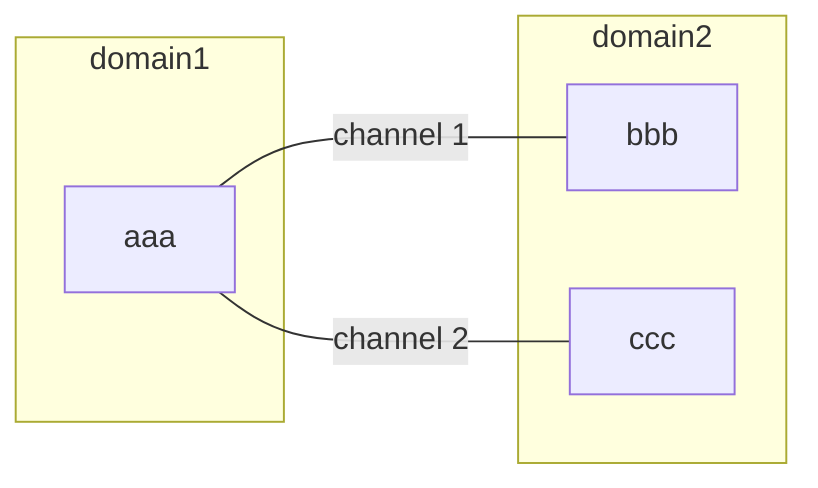
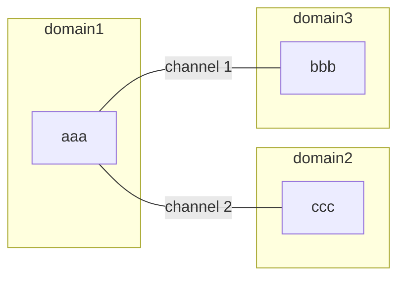

# Coffee-HDL 用户手册 v0.5

##  介绍

本文档是Coffee-HDL(coffeescript hardware description language)的使用手册.Coffee-HDL是嵌入在coffeescript编程语言中的硬件构造语言,是一种对coffeescript语言做了词法编译的改造扩充后的DSL,所以当您编写Coffee-HDL时,实际上是在编写构造硬件电路的coffeescript程序.

作者并不假定您是否了解如何在coffeescript中编程,我们将通过给出的例子指出必要的Coffee-HDL语法特性,大多数的硬件设计可以使用本文中包含的语法来完成.在1.0版本到来之前,还会有功能增加和语法修改，所以不保证后继版本向下兼容.

对于宿主语言coffeescript 我们建议您花费几个小时浏览[coffeescript.org](https://coffeescript.org)来学习coffeescript的基本语法,coffeescript是一门表达能力很强但是又非常简单的动态语言,最终编译器会翻译成javascript语言通过nodejs引擎运行, 进一步的学习请参考一本优秀的coffeescript书籍 ["coffeescript in action"](https://www.manning.com/books/coffeescript-in-action).

##  安装
Coffee-HDL需要nodejs v10以上环境支持以及2.4以上版本的coffeescript编译器支持,如果操作系统没有自带nodejs环境,请在 https://nodejs.org/en/download/ 下载相应版本,解压缩以后把path指向nodejs安装目录的bin目录就可以了.

Coffee-HDL安装步骤

		git clone https://e.coding.net/thriller/carbonite.git
		cd carbonite
		npm install #or yarn install
		source sourceme.sh
		./setup.sh

##  设计目标
Coffee-HDL关注二进制逻辑设计,能表达所有的verilog时序电路和组合电路,包括多时钟,同步异步复位,带延迟的非阻塞赋值,时钟门控结构,请把Coffee-HDL当作语义化的rtl描述语言,而不是高级抽象描述语言.Coffee-HDL的设计目标按优先级排列如下:

* 语义化表达电路结构

* 方便模块集成和互联

* 语义化指导综合等流程工具

* 对verilog互动友好,生成代码可读性良好,易于debug

* 强调参数化设计,动态生成verilog描述,彻底去除使用define条件编译

* 仿真器中立,对功能验证提供高层次的支持

  

除此以外，Coffee-HDL还注重以下几点

* 轻量化,容易部署，融入Javascript生态

* 生成代码可读性良好,易于debug

* 编译快速

  

Coffee-HDL的未来要实现的功能	
* 使用宿主语言coffeescript仿真
* 对firrtl支持

## 文件类型和模块
Coffee-HDL模块描述文件以.chdl作为文件后缀名,一个模块一个文件,导入模块
使用importDesign(file_name),  其中file_name可以省略.chdl后缀名,如果导入普通coffeescript模块,使用标准的require方式导入.

Coffee-HDL描述文件可以分为两类，模块设计文件和函数库文件:

1.	模块设计文件：每个文件包含一个硬件设计模块，对应verilog语言的Module，需要使在模块顶部

> module_name=importDesign(“module_file_path”)

   的方式导入以后才能使用。


2.	函数库文件：每个文件包含一些能生成硬件电路的函数，这些函数将会展开成数字逻辑电路，在构造函数通过

> Mixin importLib(“library_path”)

语句引入函数库。函数库分为系统自带的库和第三方库，系统自带库只需要给出名字，第三方库需要提供路径(绝对路径或者相对路径)。通过Mixin方式导入的函数可以当作类成员函数来使用，库函数约定凡是返回硬件电路的函数名都需要使用$前缀，编程人员可以通过函数名清晰的知道该函数会生成电路。编译器缺省会导入自带的chdl_primitive_lib函数库，该函数库提供了一些常用电路生成函数。


电路模块内容一般是三部分组成

1. 实例化子模块
2. 在构造函数内申明port,wire,channel,reg等资源,并且绑定channel到cell的端口
3. 在build函数内描述模块的数字逻辑,主要是assign等语句构成

示例代码(test/integration/import_simple.chdl),语法细节请参见后面的介绍

```coffeescript
cell1 = importDesign('./cell1.chdl')  #引入子模块

class ImportSimple extends Module     #申明当前模块
  u0_cell1: new cell1()               #例化子模块

  constructor: ->
    super()
    Port(                             #端口申明
      bindBundle: bind('up_signal')   #绑定通道
      clock: input().asClock()        #输入时钟信号
      rstn: input().asReset()         #输入复位信号
    )

    Reg(
      data_latch: reg(16)            #寄存器
    )

    Wire(
      data_wire: wire(16)           #线
    )
    
    Channel(
    	up_signal: channel()       #通道
    )

    @u0_cell1.bind(
      bundle:  @up_signal   #通道和例化模块端口对接
    )

  build: ->                         #模块内部数字逻辑
    assign @data_wire = @up_signal.din+1

    always
      assign @data_latch = @data_wire*2

module.exports=ImportSimple
```
生成代码
```verilog
`ifndef UDLY
`define UDLY 1
`endif
module ImportSimple__1(
  input clock,
  input rstn,
  input [15:0] bindBundle__din,
  output [15:0] bindBundle__dout
);
//wire declare
wire [15:0] data_wire;
wire [15:0] up_signal__din;
wire [15:0] up_signal__dout;
//port wire declare
wire clock;
wire rstn;
wire [15:0] bindBundle__din;
wire [15:0] bindBundle__dout;
//register declare
//register init and update
reg [15:0] data_latch;
reg [15:0] _data_latch;
always @(posedge clock or negedge rstn) begin
  if(!rstn) begin
    data_latch <= #`UDLY 0;
  end
  else begin
    data_latch <= #`UDLY _data_latch;
  end
end

//channel declare
//pipeline declare
//assign logic
assign up_signal__din = bindBundle__din;
assign bindBundle__dout = up_signal__dout;
assign data_wire = up_signal__din+1'b1;
//register update logic
always_comb begin
  _data_latch=data_latch;
  _data_latch = data_wire*2'd2;
end

//datapath logic
//cell instance
cell1 u0_cell1(
  .bundle__din( up_signal__din),
  .bundle__dout( up_signal__dout),
  .clock( clock ),
  .rstn( rstn )
);

endmodule
```

## 语言要素

1.	 标识符
Coffee-HDL语言标识符可以是任意字母，数字，$符号和_符号的组合，但是标识符的第一个字母不可以是数字或者_,标识符中不可以出现_ _ (连续两个下划线)。标识符的区分大小写的。以下标识符都是合法的：
        	• add
        	• ADD
        	• Add_1
        	• $add
这些标识符是不合法的
        	• _add
        	• Add__1
        	• 1add


​    
2. 注释
   Coffee-HDL使用Coffeescript定义的#号作为行注释的起始符号，用###作为多行注释的起始和结尾符号

   

3. 格式
   Coffee-HDL区分大小写,大小写不同的标识符是不同的。Coffee-HDL语句块使用缩进代表作用域范围，具体规则请参见Coffeescript语言手册。

   

4. 数值字面量

   Coffee-HDL数值字面量指保存在wire或者reg的bit值,在Coffee-HDL里面不支持X态和Z态,只有0和1两种状态,数值字面量一般带有宽度信息.,字面量类型沿用verilog的表达形式

   有三种表达形式:
```
	a. 使用函数hex/oct/bin/dec(width,value)生成verilog中的字面量表达,比如

		hex(32,0x55aa) => 32’h55aa
		bin(4,0x3)     => 4’b0011

    b. 使用[width]’[hodb][value]’字面量表达,比如

		32’h55aa’ => 32’h55aa
		4’b0011’   => 4’b0011

	c. 使用Coffeescript基本整数类型,如果宽度大于32,需要在数字最后加上n，表达为BigInt数据类型。
	   编译器会根据数据有效宽度自动加上宽度信息，比如
		
		0x55aa => 15’h55aa
		0xffffffffffn => 40’hffffffffff
```

示例代码如下

```verilog
		hex(12,0x123) // 12'h123
		hex(0x123)    // 'h123
		hex(123)      // 'h7b
		bin(9,12)     // 9'b1100
		oct(12, 123)  // 7'o173
		0x123         // 'h123
		0b1100        // 'b1100
		12'h123'      // 12'h123
		32'hffff55aa'  //32'hffff55aa
```


## 组合电路表达

Coffee-HDL采用“$”符号作为verilog组合电路表达式的前导符,如果电路表达式是单行跟在assign() = 后面可以省略$符号，电路表达式会产生相应的的verilog组合电路表达式,其中有几个限制需要注意

* 可以用 @name 的方式直接引用模块内部的wire,reg等资源
* 需有求值的部分必须放在{}中,比如局部变量,原生数据计算等等
* 除此以外的符号都按照字面量生成在verilog表达式当中
* 三目运算符的: 通过$if $else 结构代替
* 由于{}符号作为求值运算符存在,verilog原生的{}运算符的使用cat()函数代替
* 位扩展操作{n{net}}使用expand函数代替 

示例代码
```coffeescript
build: ->
  data=100
  assign(@out) = {data+1} + hex(5,0x1f)
```
生成代码
```verilog
assign out = 101+5'h1f;
```
## assign/consign
Coffee-HDL的组合电路通过assign/consign语句生成,被赋值对象可以是reg或者wire，

如果被赋值对象是reg类型变量，赋值动作生成连接到D Flip-flop输入端的组合电路，reg会等到相应的时钟边沿更新到寄存器输出端。

赋值的右手边可以是等号后面的单行$表达式，也可以是缩进语句块的返回值，返回值必须是$表达式

Coffee-HDL的组合电路信号传递通过assign/consign语句生成,两者的区别在于assign是对wire传递信号，consign是对reg的d端传递信号，如果用assign对reg传递信号，功能正确但是编译会提出警告，consign对wire传递信号，编译会报错，表达方式为

```coffeescript
assign signal  = expr 
consign dff = expr
```
或者 
```coffeescript
assign signal
   语句块
consign dff
   语句块
```
语句块的返回值必须是$表达式产生的verilog语句

示例代码

```coffeescript
assign @dout
  $if(@sel1)    =>     $ @din+1
  $elseif(@sel2)  =>   $ @din+2
  $elseif(@sel3)  =>   $ @din+3
  $else          =>    $ @din
```

生成代码

```verilog
dout = (sel1)?din+1:(sel2)?din+2:(sel3)?din+3:din;
```

区分assign/consign的主要原因是在代码上可以直观的知道当前获得值的信号是组合逻辑还是寄存器，被assign的信号，获得值当前可以继续运算，被consign的的信号，传递生效时间是下一个相关寄存器时钟有效沿发生的时候，寄存器当前的值没有立即改变，如果需要获得寄存器d端的当前值可以使用寄存器成员函数.next()获得，示例代码:

```coffeescript
consign dout1 = a + b
consign dout2 = dout1.next()
```

生成代码

```verilog
assign _dout1 = a + b;
always @(posedge clk or negedge rstn) begin
    if(!rstn) begin
        dout1 <= #`UDLY 0;
    end
   	else begin
        dout1 <= _dout1
    end
end
assign _dout2 = _dout1;
always @(posedge clk or negedge rstn) begin
    if(!rstn) begin
        dout2 <= #`UDLY 0;
    end
   	else begin
        dout2 <= _dout2
    end
end
```


这里dout2传递的是dout1的d端，所以dout1和dout2的值始终是一样的


## always

always后面跟随一个语句块，语句块由$if-$elseif-$else分支语句和assign赋值语句组成，在always语句块内assign/consign的对象可以是wire，也可以是reg。

```coffeescript
	always
	  语句块
```

如果assign对象是wire类型，编译器会通过给被赋值wire加上pending值（缺省是0）确保不会生成意外的latch，如果assign对象是reg类型，编译器会自动把reg的输出端当成被赋值对象的pending值。wire和reg的pending的值可以显式的指定。

示例代码:

```coffee
always
	dout.pending(1)
	$if(enable)
		assign dout = din
```

生成verilog:

```verilog
always_comb begin
 	dout=1;  // dout 缺省状态为1
 	if(enable) begin
		dout = din;
	end
end
```

语法糖 always_if(cond) 是对

```coffeescript
	always
		$if(cond)
			语句块
```
的简化写法

---
class: middle
示例代码
```coffeescript
dout = reg(8)
always
	$if(sel1)
		assign dout = 1
	$elseif(sel2)
		assign dout = 2
```
生成代码
```verilog
reg [7:0] dout;
wire [7:0] _dout;
always @(negedge _clock or negedge _reset) begin
  if(!_reset) begin
    dout <= #`UDLY 0;
  end
  else begin
    dout <= #`UDLY _dout;
  end
end

always_comb begin 
  _dout = dout;
  if(sel1) begin 
  	_dout = 'd1;
  end
  else if(sel2) begin
  	_dout = 'd2;
  end
end
```

## wire 
wire类型是用于表达组合电路输出结果的元素,对应生成verilog的wire,最简单声明方式如下
```coffeescript
Wire wire_name: wire(number|[])
```

如果把wire组织成数组,声明方式如下

生成10个16bit宽度线

```coffeescript
Wire( 
    wire_array: wire(16) for i in [0...10]
)
```

或者

把三个10,20,30bit宽度的线组成数组

```coffeescript
Wire(
    wire_array: [
	      wire(10)
	      wire(20)
	      wire(30)
    ]
)
```

数组对象可以通过@wire_array[0]的方式引用

如果把wire组织成map型数据结构,声明方式如下
    
```coffeescript
Wire wire_struct: {
  key1: wire(1)
  aaa: {
    bbb: wire(16)
    }
}
```

map数据结构可以通过@wire_struct.aaa.bbb的方式引用.

wire类型通过()操作符获取bit或者切片,data(1)取bit1,data(2:0)或者data(0,3)取bit[3:0],对于slice或者bit可以设置字段名(setField)使其语义化,

示例代码
```coffeescript
constructor: ->
  Wire(
    result: wire(33).setField(
      carry: [32,32]
      sum: [31:0]
      )
    )
    
build:->
  assign @result.field('carry') = 1
  assign @result.field('sum') = 32'h12345678'
```
生成代码
```verilog
assign result[32] = 1'b1;
assign result[31:0] = 32'h12345678;
```
如果参数是一个列表的话，列表里面是带有宽度信息的信号或者常量，生成的wire宽度是列表内宽度的总和，这个wire会被assign成所有列表信号的拼接.

```coffeescript
result = wire([a,b,10'b0'],'result')
```

生成代码

```verilog
wire result_1 = {a,b,10'b0};
```

还有一种wire,通过unpack_wire函数可以构造一种线，这种线可以解开成列表里面的信号，并自动计算宽度

示例代码

```coffeescript
data = unpack_wire([e,f],'data')
```

生成代码

```verilog
wire [23:0] __data_29;
assign __f_28 = __data_29[15:0];
assign __e_27 = __data_29[23:16];
```


wire类型带有以下常用方法
 * reverse() 高低位逆序排列

 * select( (index)=> func) 根据函数式取得wire相应bit组成新的wire

 * toList() 把多比特wire按bit次序，变成一个list,例如3bit信号a, a.toList() 生成 [a(0),a(1),a(2)]

 * drive(list...)  当前寄存器驱动list里面的所有信号

    

    示例代码

```coffeescript
Wire (
  in: wire(8)
  out: wire(8)
)

build: ->
    assign @out = @in.reverse()
```
生成代码
```verilog
wire [7:0] in;
wire [7:0] out;
assign out = {in[0],in[1],in[2],in[3],in[4],in[5],in[6],in[7]};
```
示例代码
```coffeescript
assign @out = @in.select((i,bit)=> i%2==0)
```
生成代码
```verilog
assign dout = {w3[4],w3[2],w3[0]};
```


**wire的另外一种申明**

wire声明还有前缀表达形式Net wire_name/Net(wire_name,width), Net形式的申明可以在后面直接加等号或者语句块赋值

> Net foo = bar 

相当于
> foo = wire()
>
> assign foo = bar

的缩略形式

## port
在 Coffee-HDL中,端口被定义为附加在wire上的一种属性,使得wire对模块外部拥有output/input方向属性,端口也可以组织成数组,对象,或者复杂数据结构,还可以把端口数据结构单独存放在coffee模块当中,作为协议给hdl模块共享

示例代码

协议
```coffeescript
{input,output} = require 'chdl_base'

out_port={
  enable: output()
  dout: output(5)
}

in_port={
  enable: input()
  din: input(5)
}

module.exports.in_port = in_port
module.exports.out_port = out_port
```
使用
```coffeescript
#########################################################
# Design
#########################################################
{in_port,out_port} = require 'port_def'

class PortComplex extends Module
  constructor: ->
    super()
    
    Port(
      bus: [
        out_port
        in_port
      ]
    )

  build: ->
module.exports=PortComplex
```
生成代码
```verilog
module PortComplex(
  output bus__0__enable,
  output [4:0] bus__0__dout,
  input bus__1__enable,
  input [4:0] bus__1__din,
  input _clock,
  input _resetn
);
endmodule
```
端口进一步加强的语义包括如下一些方法：
* asReg(config=null): 当前output端口为reg的q端

config是可选的，通过属性确定寄存器类型，定义如下：

```coffeescript
config = {
    syncReset: boolean
    reset: string || null
    clock: string
    init:  number
    negedge: boolean
}
```


除了标准的input/output以外,还可以用bind(channel_name)的方式来连接通道,其方向和宽度由通道对接的端口的属性来决定,具体含义见下一章.


## reg,clock,reset
Coffee-HDL中的reg类型元素和verilog中d-flipflop存储类型对应,寄存器相关的有时钟
和复位信号可以来自于以下几处定义,靠前的定义优先级更高.

1. 申明reg时候指定的clock/reset信号,如果没有指定,选择defaultClock,defaultReset
2. 当前模块指定的第一个clock和reset属性的input作为defaultClock,defaultReset
3. 继承自上级模块的defaultClock,defaultReset
4. 如果没有设置@setCombModule(),模块会自动生成_clock,_reset两个输入信号作为defaultClock,defaultReset

clock相关示例代码请参见(test/basic/reg_simple.chdl)

简单的声明形式如下
    
```coffeescript
Reg ff_simple: reg(16)
```

指定clock,reset信号的寄存器申明如下
	
```coffeescript
Reg ff_full: reg(16).clock('clock').init(0).reset('rstn')
```

Coffee-HDL中reg是一个大幅度增强语义的类型元素,在声明的时候可以指定相关时钟信号名字,复位信号名和复位值,还可以指定式异步复位还是同步复位,编译器会产生对应的verilog代码来表现这些特性,Coffee-HDL编程的时候可以过滤这些特性获取reg列表.

reg可以组织成数组,对象类型或者复合类型数据结构.在生成verilog
代码的时候会产生一个伴生的d端信号,用"_"作前缀.比如上述就寄存器会自动产生如下代码
	
```verilog
reg [15:0] ff_full;
reg [15:0] _ff_full;
always @(posedge clock or nedgedge rstn) begin
	if(!rstn) begin
		ff_full <= 0;
	end
	else begin
		ff_full <= _ff_full;
	end
end 
```

此后所有对ff_full寄存器的赋值都体现在对_ff_full信号赋值的组合逻辑中.

进一步加强的语义包括如下一些方法：
	
* clock(clock_name) 指定clock信号名

* negedge() 时钟下降沿有效

* reset(reset_name) 指定reset信号名,如果reset_name是null,则这个寄存器没有reset

* syncReset()  同步复位

* highReset() 复位信号高有效,缺省是低有效

* init(value) 复位时寄存器值

* clear(signal_name，value) 当signal_name==value的时候，寄存器恢复成复位值

* stall(signal_name, value) 当signal_name==value的时候，寄存器值保持不变，优先级低于clear

* enable(signal_name,value) 当signal_name==value的时候，寄存器值可以改变，否则保持不变，优先级低于stall

* reverse() 功能和wire的reverse一致,不改变寄存器本身状态

* select(select_function) 功能和wire的select一致,不改变寄存器本身状态

* toList() 把多比特寄存器按bit次序，变成一个list,例如3bit寄存器a,a.toList() 生成 [a(0),a(1),a(2)]

* drive(list...)  当前寄存器驱动list里面的所有信号

  


**reg的另外一种申明**

reg声明还有前缀表达形式Dff variable_name/Dff(variable_name,width), Dff形式的申明可以在后面直接加等号或者语句块赋值


##  操作符

除了连接，复制，规约操作符，其余操作符功能上和优先级与verilog操作符等价:

* 算术操作符 +(加) –(减) *(乘) /(除) %(取模)
* 关系操作符 >(大于)  <(小于) >=(大于等于) <=(小于等于)
* 相等关系操作符 ==(逻辑等) !=(逻辑不等)
* 逻辑操作符  &&(逻辑与) ||(逻辑或) !(逻辑取反)
* 位操作符 &(位与) |(位或) ~(位取反) ^(位异或) 
* 移位操作符 >>(左移) <<（右移）

Coffee-HDL连接，复制，规约操作符通过函数实现

* 连接

  cat(signal1, signal2,…) 等价于 {signal,signal2,…}

* 复制

  expand(n, signal) 等价于 {n{signal}}

* 归约操作符

```
  	all1() 等价于 &
    all0() 等价于 ~|
   	has0() 等价于 ~&
   	has1() 等价于 |
	hasOdd1() 等价于 ^
	hasEven1() 等价于 ~^
```

## 位选择和部分选择

- 位选择使用括号操作符signal(n)，选择signal第n位
- 部分选择使用两种形式

  - 高位到地位选择模式，signal(msb:lsb)，选择signal的第lsb位到msb位
  - 低位和宽度选择模式，signal(lsb,width)，选择从signal的第lsb位，选择宽度为width.
- 还有一些便利的的部分选择函数
  - fromMsb(n:number): 从高位选择n位信号，如果n是负数，则选择选择从高位开始的总宽度减去abs(n)的宽度
  - fromLsb(n:number): 从低位选择n位信号，如果n是负数，则选择选择从低位开始的总宽度减去abs(n)的宽度

## 分支
在verilog语言中，mux电路可以通过两种写法生成，一种是?:表达式，一种if-else语句块，在Coffee-HDL语言中，这两种方式都被统一到$if-$elseif-$else语句，编译器自动根据上下文生成相应的 ? :操作符，或者if else语句。

Coffee-HDL的数字逻辑分支形式如下

```coffeescript
$if(cond)
  block_code1
$elseif(cond)
  block_code2
$else
  block_code3
```
在assign环境下,分支语句块的返回值自动生成?:表达式,在always环境下,分支语句生成if elseif形式的组合逻辑.
示例代码
```coffeescript
assign(@w2.w4)
  $if(@in1==hex(5,1))
    $ @w2.w3+1
  $elseif(@in1==hex(5,2))
    $ @w2.w3+2

always
  $if(@in1==hex(5,1))
    assign(@r1(3,1)) = $ @din(4,2)+0x100
  $elseif(@in1==hex(5,2))
    assign(@r1(3,1)) = $ @din(4,2)+0x200
```
生成代码
```verilog
assign w2__w4 = (in1==5'h1)?w2__w3+1'b1:(in1==5'h2)?w2__w3+2'd2:0;
always_comb begin
   _r1=r1;
   if(in1==5'h1) begin
     _r1[3:1] = din[4:2]+9'h100;
   end
   else if(in1==5'h2) begin
     _r1[3:1] = din[4:2]+10'h200;
   end
 end
```


无优先级并行电路可以使用$balance语句,前提是程序员需要保证cond1,cond2互斥

示例代码

```coffeescript
assign(@out)
   $balance([                                      
    $cond(@cond1) => $ @data1                                           
    $cond(@cond2) => $ @data2                                           
  ] , 16)
```
生成代码
```verilog
assign out = (16{cond1}&(data1))|
            (16{cond2}&(data2));
```

如果需要批量化产生if elseif else语句,可以使用$order/$case语句

$order 示例代码
```coffeescript
assign @w2.w6
  $order([
    $cond(@in1(1)) => $ @w2.w3(9:7)
    $cond(@in1(2)) => $ @w2.w3(3:1)
	  $cond(@in1(3))
    $cond(@in1(4)) => $ 100
    $cond() => $ @w2.w3(6:4)
    ]
  )
```

生成代码
```verilog
assign w2__w6 =(in1[1])?(w2__w3[9:7]):(in1[2])?(w2__w3[3:1]):(((in1[3])||(in1[4])))?(100):w2__w3[6:4];
```
$case 示例代码

```coffeescript
  always
      $case(@casein) =>
        [
          $lazy_cond(10) =>
            assign(@caseout) = 100
          $lazy_cond(20)
          $lazy_cond(30)
          $lazy_cond(40) =>
            assign(@caseout) = 200
          $lazy_cond() =>
            assign(@caseout) = 300
        ]
```

生成代码
```verilog
always_comb begin /* 121 */ 
  caseout=0;
  caseout /* 131 */ = 'd300;
  if((casein=='d20)||(casein=='d30)||(casein=='d40)) begin
  	caseout /* 129 */ = 'd200;
  end
  if(casein=='d10) begin
      caseout /* 125 */ = 'd100;
  end
end
```


## 函数抽象

Coffee-HDL支持用函数生成电路以增强代码复用,生成电路函数返回值必须为$表达式，在函数内部可以声明局部wire和reg,编译器会确保在函数内部的wire和reg的变量名全局唯一，函数可以嵌套调用。

Coffee-HDL支持函数抽象表达以增强代码复用,函数声明方式是普通
coffeescript函数,在$表达式内需要求值的时候使需要{}符号对包含在内部的表达式求值,函数的输出为$表达式,表现形式如下
	
示例代码

```coffeescript
add: (v1,v2) -> $ @in3+v1+v2
mul: (v1,v2) -> $ v1*v2
build: ->
  assign @out = @add(@mul(10'h123',@in1),@in2)
```

生成代码

```verilog
assign out = in3+10'h123*in1+in2;
```

函数抽象可以嵌套调用.

## 状态机
针对状态机,reg类型有以下方法来管理状态
* stateDef(array|map)

  设置状态名称,示例代码(test/basic/reg_simple.chdl)

```coffeescript
@ff1.stateDef(['idle','write','pending','read'])
```

  生成代码

```verilog
localparam ff1__idle = 0;
localparam ff1__write = 1;
localparam ff1__pending = 2;
localparam ff1__read = 3;
```

  也可以用对象数据类型指定状态值,示例代码(test/basic/reg_simple.chdl)
		
```coffeescript
@ff2.statedef({
	idle: 100
	send: 200
	pending: 300
	})
```

生成代码
```verilog
localparam ff2__idle=100;
localparam ff2__send=200;
localparam ff2__peding=300;	
```

* isState(state_name...)

  判定寄存器值是某个状态或者若干个状态之一,比如
		
```coffeescript
@ff1.isState('idle','write')
```
  生成如下代码
		
```verilog
ff1==ff1__idle||ff1__write
```

* notState(state_name)

  判定寄存器值不是某个状态,等价于isState取反

* setState(state_name)

  设置状态,比如
		
```coffeescript
@ff1.setState('write')
```
  生成如下代码	
```verilog
_ff1 = ff1_write
```
其中_ff是寄存器d端,ff_write是localparam

* stateSwitch

  状态转移逻辑可以使用reg内置stateSwitch方法设定

示例代码(test/basic/reg_simple.chdl)
```coffeescript
always
  @ff1.stateSwitch(
    'write': [
      $cond(@stall==1) => $ @ff1.getState('pending')
      $cond(@stall==0) => $ @ff1.getState('idle')
    ]
    'pending': [
      $cond(@readEnable==1) => $ @ff1.getState('read')
      $cond() => $ @ff1.getState('idle')
      ]
  )
```
生成代码
```verilog
always_comb begin
  _ff1 = ff1;
  if(ff1==ff1__write) begin
    if(stall==1) begin
      _ff1 = ff1__pending;
    end
    else if(stall==0) begin
      _ff1 = ff1__idle;
    end
  end
  if(ff1==ff1__pending) begin
    if(readEnable==1) begin
      _ff1 = ff1__read;
    end
    else begin
      _ff1 = ff1__idle;
    end
  end
end
```

## 实例化模块
在构造函数中使用CellMap或者CellList两种方式实例化子模块，实例化的子模块是无法直接组织成数据来使用的。

CellMap有两种模式,一种是对象模式
```coffeescript
constructor: ->
    CellMap(
    	cell_name: new cell()
	)
```
或者是列表模式
```coffeescript
constructor: ->
    CellMap([
    	{name:'cell_name', inst: new cell()}
	])
```
在CellMap实例化的子模块名字都是程序员编程决定，这些名字都会作为当前模块的成员变量存在，后面需要使用的时候通过@符号引用，比如@cell_name

如果不关心子模块的实例化名字，可以使用CellList来实例化这些子模块，编译器会自动生成这些子模块的实例化名字，模块的引用需要程序员自己赋值给成员变量来使用
```coffeescript
constructor: ->
	list = (new cell() for i in [0...12])
    CellList(list...)
```
这里会实例化12个cell,实例化名字自动生成，对这些子模块的引用通过list[index]获得

## 通道

通道是对连接的抽象,在Coffee-HDL中,channel的作用是取代verilog例化cell时候的port-pin连接的方式.和port-pin连接主要的区别channel是运行时确定宽度信息并检查,channel可以通过传统的port-pin方式逐步穿越层次,也可以跨层次互联自动生成端口.声明语句如下:
```coffeescript
constructor: ->
    CellMap(
    	some_cell: new sub_module()
	)
	Channel(
		channel_name: channel()
	)

	@some_cell.bind(
  		port_name:   @channel_name
	)
```

这里的channel_name对应some_cell.port_name


也可以使用@mold函数，而不是显式bind

```coffeescript
constructor: ->
    CellMap(
    	some_cell: new sub_module()
	)
	Channel(
		channel_name: @mold(@some_cell)
	)
```

这里的channel_name相当于是some_cell的引用，后面通过channel_name.port_name来获得some_cell.port_name


也可以使用Probe方式

```coffeescript
Probe(
  channel_name: 'cell.channel_name'
)
```
前两种形式代表从cell pin绑定channel,
Probe形式代表从子层次模块抽取channel到当前模块


如果把channel作为端口引出当前模块

```coffeescript
Port(
  some_port: bind('channel_name')
)
```
把channel作为wire使用时候，直接存取channel成员下的路径

```coffeescript
assign @dout = $ @cell1_ch.din(3:0)+@cell2_probe.din
```

生成代码
```verilog
assign dout = cell1_ch__din[3:0]+cell2_probe__din;
```

## 序列
为了把更加容易理解的序列操作变成硬件电路或者行为语句，可以用$sequence模式编程，序列分为可综合序列和行为序列，在initial中出现的是行为序列，操作对象是vreg类型变量，在sequenace_always中出现的是可综合序列，操作对象是reg,port,wire.

可综合序列触发条件和回调函数形式

* posedge(signal:string|object) (trans,next) =>
* negedge(signal::string|object) (trans,next) =>
* next(cycle: number) (trans,next)=>
* wait(expression:$expr) (trans,next)=>
* end()

行为序列触发条件和回调函数形式

* init =>
* posedge(signal:string|object) =>
* after_posedge(signal:string|object,delay=0.1) =>
* negedge(signal:string|object) =>
* wait(expression:$expr) =>
* delay(delay:number) =>
* trigger(trigger_name:string) =>
* event(tringger_name:string)
* repeat(repeat_imes:number)
* do =>
* polling(signal:string|object,expr:$expr) =>
* end()

可综合事件对应的回调函数带有两个参数，第一个参数trans是进入状态的的信号,第二个参数next是退出状态时候的信号

示例代码
		
```coffeescript
 $sequence('writeSeq') =>
        assign @cs = 0
      .posedge(@sel) =>
        assign @cs = 1
        assign @addr_out = @addr
      .next(5) =>
      .negedge(@sel) (trans,next)=>
        $if(trans)
          assign @cs = 0
        $elseif(next)
          assign @addr_out = 16'hffff'
      .wait($(@finish==1)) =>
        assign @addr = @addr+4
      .end()
```
在initial当中的sequence，编译结果是verilog行为语句，目的在于描述testbench行为。

在always当中如果使用序列，编译器会在最终状态自动根据第一个状态的触发条件决定是回到idle,还是直接进入第一个状态.


##  集成
除了使用通常的port-pin方式逐步向上信号互联集成的方式以外,Coffee-HDL还可以使用hub方式集成.

申明方式如下:
```coffeescript
$channelPortHub(channel1,channel2,...)
```
当前层会产生一套互联列表中的所有channel所关联的信号名字,根据名字和方向匹配,完成互联.互联完成以后如果有浮空的input会报错.

示例代码
```coffeescript
class HubSimple extends Module
  
  constructor: ->
    super()
    
    CellMap(
        u0_cell1: new cell1()
  		u0_cell2: new cell2()
    )

    Probe(
      aaa: 'u0_cell1.master_channel'
      bbb: 'u0_cell2.slave_channel'
    )

  build: ->
    $channelPortHub(@aaa,@bbb)
```

通过channel的连接方式,模块的层次结构很容易重构,如下面的例子所示

Diagram 1



```coffeescript
class top extends Module
 
  constructor: ->
    super()
    
    CellMap(
     	domain1: new cell1()
  		domain2: new cell2()
	)

    Probe(
      aaa1: 'domain1.ch1'
      aaa2: 'domain1.ch2'
      bbb: 'domain2.ch'
      ccc: 'domain2.ch'
    )

  build: ->
    $channelPortHub(@aaa1,@bbb)
    $channelPortHub(@aaa2,@ccc)
```

---
Diagram 2


```coffeescript
class top extends Module

  constructor: ->
    super()
    
    CellMap(
    	domain1: new cell1()
  		domain2: new cell2()
  		domain3: new cell3()
	)

    Probe(
      aaa1: 'domain1.ch1'
      aaa2: 'domain1.ch2'
      ccc: 'domain2.ch'
      bbb: 'domain3.ch'
    )

  build: ->
    $channelPortHub(@aaa1,@bbb)
    $channelPortHub(@aaa2,@ccc)
```


## 关键字

操作符

* assign signal [= expr || block]
* always block
* always_if(cond) block

类型

* input(width:number)
* output(width:number)
* vec(width:number,depth:number)
* bind(name:string)
* reg(width:number)
* channel()
* wire(width:number)

电路生成

* $if(expr)
* $elseif(expr)
* $else
* $cond(expr) =>
* $ expr
* $expand(times,signal)
* $cat(signal1,signal2...)
* $order(list)
* $balance(list)

模块资源申明

* Port()
* Probe()
* Wire()
* Net()
* Dff()
* Channel()
* Mem()
* Reg()

模块自带方法

* @setBlackBox()
* @specifyModuleName(name:string)
* @setCombModule()
* @moduleParameter(parameter_list)
* @instParameter(parameter_list)
* @verilog(verilog_string:string)

## 感谢
powelljin,lizhousun,siyu,solar对本项目提的意见以及小白鼠工作
