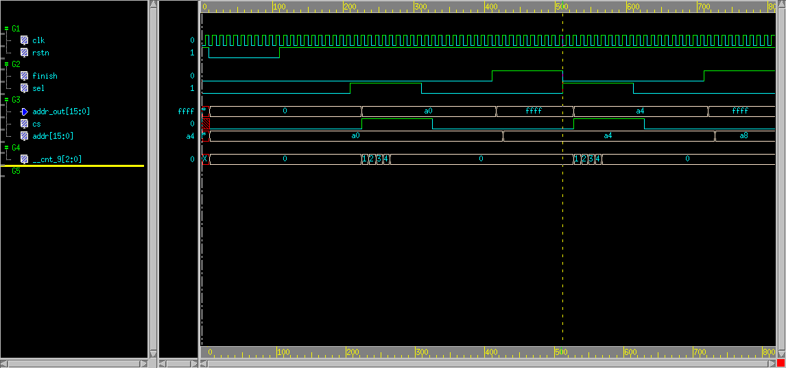

class: center, middle, inverse

# coffee-hdl 介绍

	伍骏 2019-12-21
---

name: agenda

# Agenda

1. [背景和技术栈](#stack)
2. [设计目标](#target)
3. [文件和模块](#module)
4. [语法](#syntax)
5. [函数](#function)
6. [状态机](#state)
7. [序列(sequence)](#sequence)
8. [通道(channel)](#channel)
9. [集成](#assembly)
10. [扩展和库](#lib)
11. [杂项和关键字](#keyword)

---
name: stack

## 背景和技术栈 
* coffee-hdl是以coffeescript为宿主语言的用于生成verilog代码的dsl

* coffeescript是一种可以转换成javascript文件的编程语言，特点是语法简单，表达能力强，有编程基础的可以在两个小时左右学会该语言，和javascript库可以无缝互操作。运行环境需要安装v8以上的node.js环境和2.4版本以上的coffeescript编译器。

* 基本流程

<div class="mermaid">
  graph LR
  A(chdl文件) -->|编译|B( javascript文件) -->|node.js| D(verilog文件)
</div>

---
name: target

## 设计目标
* verilog的相容性
	* 具备verilog rtl级别的所有表达能力
	* 采用verilog相同的基本数据类型
	* 宿主语言和生成代码有清晰边界
	
* 提升
  * 强调基于函数的复用而不是模块
  * 基于数据结构对硬件资源编程
  * 语义化表达电路结构
  * 方便模块集成和互联
  * 轻量化,容易部署,生成代码可读性良好,易于debug,编译快速
  * 高层次参数化设计,全动态生成verilog描述,避免第二次元编程

---
name: module

##  文件和模块

* coffeescript-hdl模块描述文件以.chdl作为文件后缀名,一个模块一个文件

* 例化模块需要先导入模块，使用importDesign(file_name)

模块内容一般是三部分组成
1. 在构造函数内申明port,wire,channel,reg,实例化子模块等资源,并且绑定channel到cell的端口

2. 在build函数内描述模块的数字逻辑,主要是assign,always等语句构成

3. 其他生成电路的函数

---

#### 示例代码

```coffeescript
cell1 = importDesign('./cell1.chdl')  #引入子模块

class ImportSimple extends Module     #申明当前模块
  constructor: ->
    super()
    
    @u0_cell1= new cell1()            #例化子模块
    CellMap('u0_cell1',@u0_cell1)
    
    Port(                             #端口申明
      bindBundle: bind('up_signal')   #绑定通道
      enable: input()                 #输入信号
      clock: input().asClock()        #输入时钟信号
      rstn: input().asReset()         #输入复位信号
    )
    
    Reg(
      data_latch: reg(16)           #申明寄存器
    )
    
    Wire(
      data_wire: wire(16)           #申明线
    )
    
    Channel(
    	up_signal: channel()        #通道申明
    )
    
    @u0_cell1.bind(
      bundle:  @up_signal           #通道和例化模块端口对接
    )
    
  build: ->                         #模块内部数字逻辑
    assign @data_wire = @up_signal.din+1

    always_if(@enable)
      assign @data_latch = @data_wire*2
      
module.exports=ImportSimple
```

---
layout: false

#### 生成代码

	chdl_compile.coffee test.chdl

.left-column[

```verilog
`ifndef UDLY
`define UDLY 1
`endif
module ImportSimple__1(
  input clock,
  input rstn,
  input enable,
  input [15:0] bindBundle__din,
  output [15:0] bindBundle__dout
);
//wire declare
wire [15:0] data_wire;
wire [15:0] up_signal__din;
wire [15:0] up_signal__dout;
//port wire declare
wire clock;
wire rstn;
wire enable;
wire [15:0] bindBundle__din;
wire [15:0] bindBundle__dout;
//register declare
//register init and update
reg [15:0] data_latch;
reg [15:0] _data_latch;
always @(posedge clock or negedge rstn) begin
  if(!rstn) begin
    data_latch <= #`UDLY 0;
  end
  else begin
    data_latch <= #`UDLY _data_latch;
  end
end
```
]

.right-column[

```verilog
//channel declare
//pipeline declare
//assign logic
assign up_signal__din = bindBundle__din;
assign bindBundle__dout = up_signal__dout;
assign data_wire = up_signal__din+1'b1;
//register update logic
always_comb begin
  _data_latch=data_latch;
  if(enable) begin
  	_data_latch = data_wire*2'd2;
  end
end

//datapath logic
//cell instance
cell1 u0_cell1(
  .bundle__din( up_signal__din),
  .bundle__dout( up_signal__dout),
  .clock( clock ),
  .rstn( rstn )
);

endmodule
```
]

---
name: syntax
## 语法

* 数值字面量

  

* 资源申明

  * Port

  * Reg

  * Wire

  * Channel

    

* 组合电路表达

  * assign 语句
  * always 语句
  * mux 电路

---

###  数值字面量
* 数值字面量指保存在wire或者reg的bit值

   

* 不支持X态和Z态,只有0和1两种状态,数值字面量一般带有宽度信息

* 两种表达方式   

	* 使用函数hex/oct/bin/dec(width,value)生成verilog中的字面量数字

	* 使用[width]\\[hodb][value]字面量表达,如果使用coffeescript基本整数类型,自动转换为'd[value]

```
		hex(12,0x123) // 12'h123
		hex(123)      // 'h7b
		bin(9,12)     // 9'b1100
		oct(12, 123)  // 7'o173
		0x123         // 'h123
		0b1100        // 'b1100
		12\h123       // 12'h123
		32\hffff55aa  // 32'hffff55aa
		100           // 'd100
```

---
### 资源申明

硬件资源需要声明，如果申明在构造函数内部是模块作用范围有效，如果申明在成员函数内部在函数范围有效，以下是可以申明的硬件资源
* port （必须申明在构造函数）
* wire
* reg
* channel （必须申明在构造函数）

所有的硬件资源都可以组织成数组或者对象

---
### 资源申明 - Port

Port - 指定input 或者 output 或者绑定到channel

可以指定时钟和复位信号，第一个指定的时钟和复位信号为模块内部缺省时钟和复位，如果不指定自动生成默认_clock,_reset

```coffeescript
    Port(
        clk:  input().asClock()    #reset signal
        rstn: input().asReset()    #clock signal
        data: input(5)             # 5 bit input data
        arr: [                     # array
            input(3)
            input(8)
        ]
        map:{                      # object
            cs: input(32)
            sel:[
                input(1)
                input(1)
            ]
            dout: output(32)
        }
        )
```

可以把端口数据结构单独存放在coffee模块当中,作为协议给其他模块共享

---
### 资源申明 - Reg

Reg - 可以指定宽度,相关时钟和复位信号属性,以及初始化值
```coffeescript
      Reg(
          # 使用默认clock,reset信号，异步reset,低有效
          ff0: reg(32)
          # 初始化为0，使用hclk,rstn,同步reset
          ff1: reg(5).init(0).clock('hclk').reset('rstn').syncReset()
          # 初始化为100，没有reset
          ff2: reg(6).init(100).clock('hclk').reset(null) 
          # 初始化为0xff,高reset,使用clear信号作同步reset到初始化值
          ff3: reg(7).init(0xff).clock('hclk').highReset().clear('clear')
          # 参数化表达为异步高reset，使用时钟下降沿
          ff4: reg(9).clock('hclk').reset('rstn','async',true).negedge()   
      )
```

---
### 资源申明 - Wire
Wire  - 指定宽度
```coffeescript
    Wire(
        data: wire(32)
    )
```
可以设置字段名(setField)使其语义化

示例代码
```coffeescript
constructor: ->
  Wire(
    result: wire(33).setField(
      carry: [32,32]
      sum: [31:0]
      )
    )
    
build:->
  assign @result.field('carry') = 1
  assign @result.field('sum') = 32\h12345678
```
生成代码
```verilog
assign result[32] = 1'b1;
assign result[31:0] = 32'h12345678;
```

---
wire类型带有以下常用方法
	* reverse() 高低位逆序排列
	* select( (index)=> func) 根据函数式取得wire相应bit组成新的wire
示例代码
```coffeescript
Wire (
  in: wire(8)
  out: wire(8)
)

build: ->
    assign @out = @in.reverse()
```
生成代码
```verilog
wire [7:0] in;
wire [7:0] out;
assign out = {in[0],in[1],in[2],in[3],in[4],in[5],in[6],in[7]};
```
示例代码
```coffeescript
assign @out = @in.select((index,bit)=> index%2==0)
```
生成代码
```verilog
assign dout = {w3[4],w3[2],w3[0]};
```

---


***wire的另外一种申明***

wire声明还有前缀表达形式Net wire_name/Net(wire_name,width), Net形式的申明可以在后面直接加等号或者语句块赋值

> Net foo = bar 

相当于
> foo = wire()
> 
> assign foo = bar

的缩略形式
		

---
### 资源申明 - Channel
Channel - 代表接在cell/pin上的一组线，不需要指定参数
```coffeescript
    Channel(
        ahb_master: channel()
    )

	@u0_cell1.bind(
      ahb_master:  @ahb_master
    )
```

---
### 电路表达
* 采用“$”符号作为verilog组合电路表达式的前导符

* 如果电路表达式是单行跟在assign signal  = 后面可以省略$符号

* 模块内部的wire,reg,port等资源都是一等公民，直接使用变量名

* $表达式需要求值的部分必须放在{}中,比如局部变量,原生数据计算等等

* 除此以外的符号都按照字面量生成在verilog表达式当中

* 三目运算符?: 使用$if $else 结构代替

* 由于{}符号作为求值运算符存在,verilog原生的{}运算符的使用cat()函数代替

* 位扩展操作{n{net}}使用expand函数代替 

* 位选使用括号操作符foo(n)

* 切片选择使用括号操作符号,两种形式foo(msb:lsb),或者foo(lsb,width)

---
示例代码
```coffeescript
build: ->
  data=100
  assign out1 = {data+1} +5\h1f
  assign out2 = cat(data,5\h1f)
  assign out3(5:3) =  data(0,3)
  assign out4 = expand(5,data(9:7))
```
生成代码
```verilog
assign out1 = 101+5'h1f;
assign out2 = {data,5'h1f};
assign out3[5:3] = data(2:0);
assign out4 = {5{data[9:7]}}
```

---
### 电路表达-assign语句
coffee-hdl的组合电路信号传递通过assign语句生成,表达方式为


```coffeescript
# 直接赋值,此处expr可以省略$前导符
	assign signal = expr
# 语句块赋值
	assign signal
		语句块
```

signal可以是reg或者wire,缩进语句块的返回值必须是$表达式。
	
示例代码
```coffeescript
assign dout1 = a + b
assign dout2 
  $if(sel1)      =>   $ din+1
  $elseif(sel2)  =>   $ din+2
  $elseif(sel3)  =>   $ din+3
  $else          =>   $ din
```

生成代码
```verilog
dout1 = a + b;
dout2 = (sel1)?din+1:(sel2)?din+2:(sel3)?din+3:din;
```
---
### 电路表达-always语句
always后面跟随一个语句块，语句块由$if $else和assign组成

```coffeescript
	always
		语句块
```

always内部assign也是对wire赋值，如果赋值对象是寄存器名，则实际是对寄存器D端的wire赋值，编译器会通过给被赋值wire加上pending值确保不会生成意外的latch

always_if(cond) 是对
```coffeescript
	always
		$if(cond)
			语句块
```
的简化写法

---
class: middle
示例代码
```coffeescript
dout = reg(8)
always
	$if(sel1)
		assign dout = 1
	$elseif(sel2)
		assign dout = 2
```
生成代码
```verilog
reg [7:0] dout;
wire [7:0] _dout;
always @(negedge _clock or negedge _reset) begin
  if(!_reset) begin
    dout <= #`UDLY 0;
  end
  else begin
    dout <= #`UDLY _dout;
  end
end

always_comb begin 
  _dout = dout;
  if(sel1) begin 
  	_dout = 'd1;
  end
  else if(sel2) begin
  	_dout = 'd2;
  end
end
```

---
### 电路表达-mux电路

在verilog中，mux电路会通过两种写法生成，一种是?:表达式，一种if-else语句块，在coffee-hdl语言中，这两种生成方式都被统一到$if-$else语句，编译器自动根据上下文生成相应的 ? :操作符，或者if else语句。

1. assign 语句块出现的$if-$else会生成? :操作符
2. always 语句块出现的$if-$else会生成if else语句

除了通过$if-$else字面量生成mux电路外，coffee-hdl还提供了通过$cond列表的方式批量生成mux电路。缺省提供两种方式

* 带优先级的函数$order/$case
* 没有优先级平行输出函数$balance

请注意，这两个函数都是通过库的方式导入的普通函数，并不是语法的一部分，程序员也可以自己编程产生自己需要的形式，不需要通过元编程来解决

---
class: middle

$order 示例代码
```coffeescript
assign(w2.w6)
  $order([
    $cond(in1(1)) => $ w2.w3(9:7)
    $cond(in1(2)) => $ w2.w3(3:1)
	$cond(in1(3))
    $cond(in1(4)) => $ 100
    $cond() => $ w2.w3(6:4)
    ]
  )
```

生成代码
```verilog
assign w2__w6 =(in1[1])?(w2__w3[9:7]):(in1[2])?(w2__w3[3:1]):(((in1[3])||(in1[4])))?(100):w2__w3[6:4];
```

---
class: middle
$case 示例代码

```coffeescript
  always
      $case(@casein) =>
        [
          $lazy_cond(10) =>
            assign(@caseout) = 100
          $lazy_cond(20)
          $lazy_cond(30)
          $lazy_cond(40) =>
            assign(@caseout) = 200
          $lazy_cond() =>
            assign(@caseout) = 300
        ]
```

生成代码
```verilog
always_comb begin /* 121 */ 
  caseout=0;
  caseout /* 131 */ = 'd300;
  if((casein=='d20)||(casein=='d30)||(casein=='d40)) begin
  	caseout /* 129 */ = 'd200;
  end
  if(casein=='d10) begin
      caseout /* 125 */ = 'd100;
  end
end
```

---
class: middle

$balance 示例代码

```coffeescript
assign(out)
   $balance([                                      
    $cond(cond1) => $ data1                                           
    $cond(cond2) => $ data2                                           
  ])
```
生成代码
```verilog
assign out = (16{cond1}&(data1))|
            (16{cond2}&(data2));
```
程序员需要保证cond1,cond2互斥

---
name: function

## 函数
coffee-hdl支持函数抽象表达以增强代码复用,用于产生电路的函数返回必须为$表达式
	
示例代码

```coffeescript
add: (v1,v2) -> $ @in3+v1+v2
mul: (v1,v2) -> $ v1*v2
build: ->
  assign(@out) = @add(@mul(10\h123,@in1),@in2)
```

生成代码

```verilog
assign out = in3+10'h123*in1+in2;
```


---
class: middle

在函数内部可以自由申明wire和reg,编译器会确保在函数内部的wire和reg在生成的verilog内名字是全局唯一

示例代码

```coffeescript
fall: (sig)->
    d1 = reg(1,'dly').reset(null)
    assign d1 = sig
    return $ ((!sig)&d1)

build: ->
    assign @dout = @fall(@din)
```

生成代码

```verilog
reg __dly__0;
wire ___dly__0;
always @(posedge __clock) begin
  __dly__0 <= #`UDLY ___dly__0;
end

//assign logic
assign ___dly__0 = din;
assign dout /* 14 */ = ((!din)&__dly__0);
```

函数抽象可以嵌套调用。


---
name: state

## 状态机
针对状态机,reg类型有以下方法来管理状态
* stateDef(array|map): 设置可以用数组或者map设置状态名称和值，示例代码

```coffeescript
@ff1.stateDef(['idle','write','pending'])
@ff2.statedef({
	idle: 100
	send: 200
	pending: 300
	})
```

  生成代码

```verilog
localparam ff1__idle = 0;
localparam ff1__write = 1;
localparam ff1__pending = 2;
localparam ff2__idle=100;
localparam ff2__send=200;
localparam ff2__peding=300;	
```


---

* isState(state_name): 判定寄存器值是某个状态

示例代码	

```coffeescript
@ff1.isState('idle')
```
生成代码		
```verilog
(ff1==ff1__idle)
```

* notState(state_name): 判定寄存器值不是某个状态,等价于isState取反

* setState(state_name): 设置状态

示例代码	

```coffeescript
@ff1.setState('write')
```
   生成代码			
```verilog
_ff1 = ff1_write
```
	其中ff_write是localparam


---

* stateSwitch: 使用reg内置stateSwitch方法配合$cond表达式描述状态转移
.left-column[
示例代码
```coffeescript
always
  @ff1.stateSwitch(
    'idle': [
      $cond(@start==1) => 'write'
    ]
    'write': [
      $cond(@stall==1) => 'pending'
      $cond(@error==1) => 'idle'
    ]
    'pending': [
      $cond(@start==1) => 'write'
      $cond() => 'idle'
      ]
  )
```
]
.right-column[
生成代码
```verilog
always_comb begin
  _ff1 = ff1;
  if(ff1==ff1__idle) begin
    if(start==1) begin
      _ff1 = ff1__write;
    end
  end
  if(ff1==ff1__write) begin
    if(stall==1) begin
      _ff1 = ff1__pending;
    end
    else if(error==1) begin
      _ff1 = ff1__idle;
    end
  end
  if(ff1==ff1__pending) begin
    if(start==1) begin
      _ff1 = ff1__write;
    end
    else begin
      _ff1 = ff1__idle;
    end
  end
end
```
]

---
class: center
Diagram

<div class="mermaid">
stateDiagram
    [*] --> Idle
    Idle  --> Write : start
    Write --> Pending : stall
    Write  --> Idle : error
    Pending --> Write : start
    Pending --> Idle
</div>

---
name: sequence

## 序列(sequence)

为了把更加容易理解的序列操作变成硬件电路或者行为语句，可以用$sequence模式编程，序列分为可综合序列和行为序列，在initial中出现的是行为序列，目的在于描述testbench行为,在sequenace_always中出现的是可综合序列，操作对象是reg,port,wire.

.left-column[

可综合序列触发条件和回调函数形式

* posedge(signal name) (trans,next) =>
* negedge(signal name) (trans,next) =>
* next(cycle number) (trans,next)=>
* wait(expression) (trans,next)=>
* end()

]


.right-column[

行为序列触发条件和回调函数形式

* posedge(signal name) =>
* negedge(signal name) =>
* wait(expression) =>
* delay(delay time) =>
* trigger(trigger name) =>
* event(tringger name)
* repeat(repeat times)
* end()

]


---
class: middle


* 可综合事件对应的回调函数带有两个参数，第一个参数trans是进入状态的的信号,第二个参数next是退出状态时候的信号

* 编译器会在最终状态自动根据第一个状态的触发条件决定是回到idle,还是直接进入第一个状态。

---

示例代码
		
```coffeescript
 $sequence('writeSeq') =>
        assign @cs = 0
      .posedge(@sel) =>
        assign @cs = 1
        assign @addr_out = @addr
      .next(5) =>
      .negedge(@sel) (trans,next)=>
        $if(trans)
          assign @cs = 0
        $elseif(next)
          assign @addr_out = 16\hffff
      .wait($(@finish==1)) =>
        assign @addr = @addr+4
      .end()
```



---
name: channel

## 通道(channel)

通道是对连接的抽象,channel的作用是取代verilog例化cell时候的port-pin连接的方式.和port-pin连接主要的区别channel是运行时确定宽度信息并检查,channel可以通过传统的port-pin方式逐步穿越层次,也可以跨层次互联自动生成端口.声明语句如下:
```coffeescript
# 从cell pin绑定channel
@foo.bind(
  port_name:   @channel_name
)
```
```coffeescript
# 从子层次模块抽取channel到当前模块
Probe(
  channel_name: 'cell.channel_name'
)
```
如果把channel作为端口引出当前模块
```coffeescript
Port(
  some_port: bind('channel_name')
)
```

---
class: middle


使用的时候，直接存取channel的Port成员下的路径

```coffeescript
assign(@dout) = $ @cell2_port.din+@cell1_ch.Port.din(3:0)+@cell2_probe.din
```

生成代码
```verilog
assign dout = cell2_port__din+cell1_ch__din[3:0]+cell2_probe__din;
```


---
name: assembly

##  集成
除了使用通常的port-pin方式逐步向上信号互联集成的方式以外,还可以使用hub方式集成.

申明方式如下:
```coffeescript
$channelPortHub(channel1,channel2,...)
```
* 当前层会产生一套互联列表中的所有channel关联的信号名字,根据名字和方向匹配,完成互联
* 互联完成以后如果有浮空的input会报错.

示例代码
```coffeescript
class HubSimple extends Module
  u0_cell1: new cell1()
  u0_cell2: new cell2()

  constructor: ->
    super()

    Probe(
      aaa: 'u0_cell1.master_channel'
      bbb: 'u0_cell2.slave_channel'
    )

  build: ->
    $channelPortHub(@aaa,@bbb)
```

---

Diagram 1

<div class="mermaid">
  graph LR
    aaa-- channel 1---bbb
    aaa-- channel 2---ccc
    subgraph domain1
    aaa
    end
    subgraph domain2
    bbb
    ccc
    end

</div>
```coffeescript
class top extends Module
  domain1: new cell1()
  domain2: new cell2()

  constructor: ->
    super()

    Probe(
      aaa1: 'domain1.ch1'
      aaa2: 'domain1.ch2'
      bbb: 'domain2.ch'
      ccc: 'domain2.ch'
    )

  build: ->
    $channelPortHub(@aaa1,@bbb)
    $channelPortHub(@aaa2,@ccc)
```

---
Diagram 2
<div  class="mermaid">
  graph LR
    aaa-- channel 1---bbb
    aaa-- channel 2---ccc
    subgraph domain1
    aaa
    end
    subgraph domain2
    ccc
    end
    subgraph domain3
    bbb
    end
</div>

```coffeescript
class top extends Module
  domain1: new cell1()
  domain2: new cell2()
  domain3: new cell3()

  constructor: ->
    super()

    Probe(
      aaa1: 'domain1.ch1'
      aaa2: 'domain1.ch2'
      ccc: 'domain2.ch'
      bbb: 'domain3.ch'
    )

  build: ->
    $channelPortHub(@aaa1,@bbb)
    $channelPortHub(@aaa2,@ccc)
```

---
name: lib

## 扩展和库

可以通过在构造函数中  Mixin importLib('foo.chdl') 的方式导入第三方用于生成电路的函数库，Mixin的函数都是可以当作成员函数来使用，作为约定凡是返回$表达式的的函数名都需要使用$前缀,方便函数使用者区分宿主语言函数和电路生成函数。

系统缺省会Mixin自带的chdl_primitive_lib函数库，该函数库提供了以下常用函数(部分)

.left-column[
* $order
* $join
* $balance
* $doubleSync
* $tripleSync
* $bundleAssign
* $grayNextCode
* $arrayMuxSet
* $arrayDecode

]

.right-column[
* $rise
* $fall
* $divider
* $delay
* $count
* $count1
* $oneOf
* $inRange
* $same
* $case

]

---
name: keyword

## 杂项和关键字

### 便利函数
@verilog(string): 字符串输出到生成代码,示例代码
```coffeescript
@verilog('$display("data is %d",ff1);')
```

会在生成的verilog代码中插入 $display("data is %d",ff1);

---

### 关键字

* **assign** signal [= expr || block]
* **always** block
* **always_if**(cond) block

类型

* **input**(width:number)
* **output**(width:number)
* **vec**(width:number,depth:number)
* **reg**(width:number)
* **channel**()
* **wire**(width:number)

---

电路生成

* $**if**(expr)
* $**elseif**(expr)
* $**else**
* $**cond**(expr) =>
* $ **expr**
* **expand**(times,signal)
* **cat**(signal1,signal2...)

模块资源申明

* **Port**()
* **Probe**()
* **Wire**()
* **Net**()
* **Channel**()
* **Mem**()
* **Reg**()


---

模块自带方法

* @**setBlackBox**()
* @**specifyModuleName**(name:string)
* @**setCombModule**()
* @**moduleParameter**(parameter_list)
* @**instParameter**(parameter_list)
* @**verilog**(verilog_string:string)


